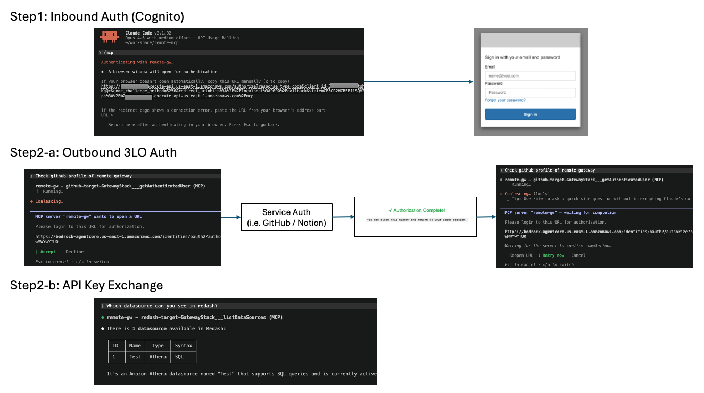

# AgentCore Gateway Remote MCP Hub for Claude Code

Amazon Bedrock AgentCore Gateway for Claude Code MCP integration.
Single gateway with multiple targets (GitHub, Notion, Slack, Redash) — one Cognito login covers all tools.

Based on the official AgentCore samples:
- [IDE Gateway Tool (Serverless OAuth Proxy)](https://github.com/awslabs/agentcore-samples/tree/main/01-tutorials/02-AgentCore-gateway/04-integration/03-ide-gateway-tool) — OAuth proxy pattern for VS Code / Claude Code
- [Fine-Grained Access Control](https://github.com/awslabs/agentcore-samples/tree/main/01-tutorials/02-AgentCore-gateway/09-fine-grained-access-control) — JWT-scope-based interceptor pattern

## Why a Single Gateway

When AI agents call external APIs directly, credentials scatter, access control fragments, and audit becomes hard. A single AgentCore Gateway solves this:

- **Credential isolation** — The agent never holds OAuth tokens or API keys. Tokens stay in Token Vault; API keys stay in DynamoDB + Interceptor Lambda. A compromised agent cannot reach external credentials.
- **Unified audit trail** — Every call to GitHub, Notion, Redash flows through one gateway. Who called what, when, and with which parameters is logged in one place (CloudTrail / CloudWatch Logs).
- **Single login** — One Cognito authentication covers all SaaS targets. 3LO targets (GitHub / Notion) require one-time per-service OAuth consent on first use, after which AgentCore manages token refresh automatically.
- **Zero agent-side config changes** — Adding a new SaaS target means adding a gateway target, not touching `.mcp.json`.
- **Self-service API key admin** — A dedicated Admin Panel (S3 + CloudFront SPA behind Cognito) lets privileged users register API keys per-service, scoped by email / Cognito group / default, without touching DynamoDB directly.

## Architecture


### Why the OAuth Proxy (API Gateway) is needed

MCP clients (Claude Code, VS Code Copilot, etc.) expect standard OAuth endpoints at the MCP server URL — specifically RFC 9728 Protected Resource Metadata (`/.well-known/oauth-protected-resource`), `/authorize`, and `/token` — to authenticate via the OAuth authorization code flow.

AgentCore Gateway validates incoming JWTs via CUSTOM_JWT auth (Cognito JWKS) but does not act as an OAuth Authorization Server itself — it does not serve these endpoints.

The OAuth Proxy (Lambda behind API Gateway HTTP API) bridges this gap:

1. **OAuth Authorization Server facade** — Serves its own RFC 9728 metadata (the `resource` identifier must match the URL the client connects to — the proxy URL, not the underlying Gateway URL) and proxies `/authorize` + `/token` to Cognito
2. **MCP forwarding** — Forwards MCP requests to AgentCore Gateway with the Cognito JWT attached
3. **3LO callback handling** — Receives the OAuth callback after user consent (GitHub / Notion), calls `CompleteResourceTokenAuth` to bind the token to the user's identity
4. **Bot PAT injection** (optional) — The IAM-authorized `/github-mcp` route injects a shared GitHub PAT for machine-to-machine access. The gateway reaches it via SigV4 (its service role); direct calls are rejected, so it stays behind CUSTOM_JWT inbound auth

```
Claude Code ──► API Gateway (HTTP API)
                  └─► OAuth Proxy Lambda
                        ├─ /.well-known/*  → Cognito discovery
                        ├─ /authorize      → Cognito hosted UI
                        ├─ /token          → Cognito token endpoint
                        ├─ /mcp            → AgentCore Gateway (JWT auth)
                        ├─ /github-mcp     → GitHub MCP + bot PAT (IAM-auth only)
                        ├─ /slack-mcp      → Slack MCP (resources/templates/list shim)
                        └─ /3lo-callback   → CompleteResourceTokenAuth
```

### Auth Flows

| Flow | Direction | When |
|------|-----------|------|
| **Inbound Auth** (Cognito) | Claude Code → OAuth Proxy → Cognito → JWT | On MCP server connection |
| **Outbound 3LO** (GitHub / Notion / Slack) | AgentCore Gateway → SaaS OAuth → User consent → Token Vault | On first tool call to a 3LO target |
| **API Key Swap** (Redash) | AgentCore Gateway → REQUEST Interceptor → Admin Table (JWT-claim match) → inject header | On every Redash tool call |
| **Bot PAT** (GitHub bot, optional) | AgentCore Gateway → (SigV4, service role) → IAM-protected `/github-mcp` proxy route → inject `Authorization: Bearer <PAT>` | On every github-bot tool call |

### Operation Flow



### Stacks

| Stack | Description |
|-------|-------------|
| `CognitoStack` | Shared Cognito User Pool + App Client (us-east-1) |
| `GatewayStack` | Unified Gateway + Redash target + OAuth Proxy + API-key Interceptor + Admin Panel (API + SPA) |

> GitHub / Notion / Slack targets are **MCP server targets** (not OpenAPI), created outside CloudFormation by `bin/sync-mcp-targets.py` — CFN cannot handle Authorization Code-grant MCP targets (creation needs interactive OAuth consent). The optional `github-bot` target (machine-to-machine PAT) is created the same way. The Redash target remains an OpenAPI target created by CDK.

## Prerequisites

- Node.js 20+, pnpm 9+
- AWS CDK v2
- Python 3.11+ (for `bin/sync-mcp-targets.py`)
- An AWS account with Bedrock AgentCore access (us-east-1)
- GitHub OAuth App (optional, for 3LO)
- Notion Integration with OAuth (optional, for 3LO)
- Slack app with OAuth (optional, for 3LO)
- GitHub PAT (optional, for the machine-to-machine github-bot target)

## Configuration

All parameters are defined in `cdk/bin/parameter.ts` and validated with Zod at synth time.

```typescript
// cdk/bin/parameter.ts
export const params = ParameterSchema.parse({
  awsAccount: process.env.CDK_DEFAULT_ACCOUNT || process.env.AWS_ACCOUNT_ID || '',
  region: 'us-east-1',
  cognitoDomainPrefix: 'remote-mcp-gateway',
  deployRedash: true,
  githubClientId: process.env.GITHUB_OAUTH_CLIENT_ID || undefined,
  githubClientSecret: process.env.GITHUB_OAUTH_CLIENT_SECRET || undefined,
  notionClientId: process.env.NOTION_OAUTH_CLIENT_ID || undefined,
  notionClientSecret: process.env.NOTION_OAUTH_CLIENT_SECRET || undefined,
  slackClientId: process.env.SLACK_OAUTH_CLIENT_ID || undefined,
  slackClientSecret: process.env.SLACK_OAUTH_CLIENT_SECRET || undefined,
  githubBotPat: process.env.GITHUB_BOT_PAT || undefined, // optional: enables the machine-to-machine github-bot target
})
```

If a required field is missing or a client ID is set without its secret, `cdk synth` fails immediately with a Zod validation error.

## Deployment

### 0. Create OAuth Apps (optional, enables 3LO targets)

#### GitHub OAuth App

1. Go to [GitHub Developer Settings > OAuth Apps](https://github.com/settings/developers)
2. Click **New OAuth App**
3. Fill in the required fields (Application name, Homepage URL). Set **Authorization callback URL** to a placeholder — you will update it in [Step 7](#7-set-oauth-app-callback-urls-3lo-only) after deploy
4. Click **Register application**
5. Copy the **Client ID** and generate a **Client secret**

#### Notion MCP OAuth Credentials (via DCR)

This project connects to Notion's hosted MCP server (`mcp.notion.com`), which is a separate OAuth 2.1 authorization server from the Notion API (`api.notion.com`). Credentials must be obtained via Dynamic Client Registration (RFC 7591) against `mcp.notion.com` — **not** from the Notion Developer Dashboard (My Integrations).

Run the provided script:

```bash
bin/register-notion-dcr.sh
```

This discovers the DCR endpoint via OAuth metadata (`/.well-known/oauth-protected-resource` → `/.well-known/oauth-authorization-server`), registers a client, and prints the `client_id` and `client_secret`.

You can also pipe directly into environment variables:

```bash
eval $(bin/register-notion-dcr.sh --export)
```

Or append to a `.env` file:

```bash
bin/register-notion-dcr.sh --env .env
```

> **Why not the Notion Developer Dashboard?** The Notion Developer Dashboard issues credentials for `api.notion.com` (the Data API). Notion's MCP server at `mcp.notion.com` runs a separate OAuth 2.1 authorization server and only accepts clients registered via its own DCR endpoint.

### 1. Set OAuth secrets (optional, enables 3LO targets)


```bash
export GITHUB_OAUTH_CLIENT_ID="..."
export GITHUB_OAUTH_CLIENT_SECRET="..."
export NOTION_OAUTH_CLIENT_ID="..."
export NOTION_OAUTH_CLIENT_SECRET="..."
export SLACK_OAUTH_CLIENT_ID="..."
export SLACK_OAUTH_CLIENT_SECRET="..."

# Optional — enables the machine-to-machine GitHub bot target (GitHub PAT,
# seeded into Secrets Manager at deploy).
export GITHUB_BOT_PAT="ghp_..."
```

### 2. Deploy

```bash
pnpm install
pnpm deploy             # builds frontend → cdk deploy GatewayStack
```

`pnpm deploy` builds the Admin Panel frontend (`frontend/`) and deploys `GatewayStack` in one step. Use `pnpm deploy:all` to deploy every stack (`CognitoStack` + `GatewayStack`).

After the stack is up, register GitHub / Notion MCP server targets (skip if not using 3LO):

```bash
pnpm sync-targets       # runs bin/sync-mcp-targets.py for github + notion
```

The sync script opens a browser for one-time OAuth consent per service (required because MCP server targets with Authorization Code grant perform `tools/list` discovery during creation). Target IDs are stored in SSM Parameter Store so reruns are idempotent.

For optional targets, create them individually (Slack uses interactive consent like GitHub/Notion; github-bot uses the seeded PAT, no consent):

```bash
python3 bin/sync-mcp-targets.py create slack       # if SLACK_OAUTH_* set
python3 bin/sync-mcp-targets.py create github-bot  # if GITHUB_BOT_PAT set
python3 bin/sync-mcp-targets.py status github-bot  # expect READY
```

### 3. Retrieve Redash credentials (if `deployRedash: true`)

Redash admin password and API key are generated at EC2 boot time and stored in Secrets Manager.

```bash
SECRET_NAME=$(aws cloudformation describe-stacks --stack-name GatewayStack \
  --query 'Stacks[0].Outputs[?OutputKey==`RedashCredentialsSecret`].OutputValue' --output text)

aws secretsmanager get-secret-value --secret-id $SECRET_NAME \
  --query SecretString --output text | jq .
```

Returns:
```json
{
  "admin_email": "admin@redash.local",
  "admin_password": "...",
  "pg_password": "...",
  "api_key": "..."
}
```

> The EC2 instance takes a few minutes to complete setup. If the secret is empty, wait and retry.

### 4. Create a Cognito user

```bash
USER_POOL_ID=$(aws cloudformation describe-stacks --stack-name CognitoStack \
  --query 'Stacks[0].Outputs[?OutputKey==`UserPoolId`].OutputValue' --output text)

aws cognito-idp admin-create-user \
  --user-pool-id $USER_POOL_ID \
  --username your-email@example.com \
  --user-attributes Name=email,Value=your-email@example.com Name=email_verified,Value=true \
  --temporary-password 'TempPassword123!' \
  --message-action SUPPRESS

aws cognito-idp admin-set-user-password \
  --user-pool-id $USER_POOL_ID \
  --username your-email@example.com \
  --password 'YourSecurePassword123!' \
  --permanent
```

### 5. Register API keys via the Admin Panel

The Gateway's API Key Swap interceptor resolves each incoming MCP call to an API key by matching JWT claims (`email`, `cognito:groups`, or the `*`/`*` wildcard) against the Admin Table in DynamoDB. Registration is done through the Admin Panel (React SPA on S3 + CloudFront).

**Step 1 — Grant yourself admin access.** The Admin API requires membership in the `admin` Cognito group (auto-created by the stack).

```bash
USER_POOL_ID=$(aws cloudformation describe-stacks --stack-name CognitoStack \
  --query 'Stacks[0].Outputs[?OutputKey==`UserPoolId`].OutputValue' --output text)

aws cognito-idp admin-add-user-to-group \
  --user-pool-id $USER_POOL_ID \
  --username your-email@example.com \
  --group-name admin
```

Sign out / sign in again so the new `cognito:groups` claim is reflected in your ID token.

**Step 2 — Open the Admin Panel.**

```bash
aws cloudformation describe-stacks --stack-name GatewayStack \
  --query 'Stacks[0].Outputs[?OutputKey==`AdminPanelUrl`].OutputValue' --output text
```

Open the URL in a browser, sign in with Cognito, then:

1. **Services** page — For Redash, the `redash` service is registered automatically by the Redash instance bootstrap (+ a default `*`/`*` mapping with the Redash admin API key). Click **Register Service** to add more services; use the `redash` preset or `Custom...` for others.
2. **API Keys** page (per service) — Register keys scoped by identity:
   - **メールアドレス** — binds to `email=<addr>`, the highest priority
   - **グループ** — binds to `cognito:groups=<group>`, matches if the user is in that group
   - **デフォルト (全員)** — binds to `*`/`*`, falls back when no per-user or per-group key matches

The interceptor evaluates candidates in priority order: email > group > default, and injects the first match as the configured header (e.g. `Authorization: Key <redash-api-key>`).

> The Admin API is `{AdminApiUrl}/services` and `{AdminApiUrl}/services/{name}/mappings`. Direct DynamoDB edits still work but bypass the audit log (each Admin API call emits a JSON `audit` entry to the handler's CloudWatch log group).

### 6. Set OAuth App callback URLs (3LO only)

After deploy, get the credential provider callback URLs:

```bash
# GitHub
aws bedrock-agentcore-control get-oauth2-credential-provider \
  --name $(aws cloudformation describe-stacks --stack-name GatewayStack \
    --query 'Stacks[0].Outputs[?OutputKey==`GitHubCredentialProviderName`].OutputValue' --output text) \
  --query callbackUrl --output text

# Notion
aws bedrock-agentcore-control get-oauth2-credential-provider \
  --name $(aws cloudformation describe-stacks --stack-name GatewayStack \
    --query 'Stacks[0].Outputs[?OutputKey==`NotionCredentialProviderName`].OutputValue' --output text) \
  --query callbackUrl --output text
```

Set these URLs in your OAuth App settings:
- **GitHub**: Settings > Developer settings > OAuth Apps > Authorization callback URL
- **Notion**: My Integrations > OAuth > Redirect URI

> These URLs change when the credential provider is recreated (stack delete + create).

### 7. Configure `.mcp.json`

```bash
# Get the values
MCP_URL=$(aws cloudformation describe-stacks --stack-name GatewayStack \
  --query 'Stacks[0].Outputs[?OutputKey==`McpUrl`].OutputValue' --output text)
CLIENT_ID=$(aws cloudformation describe-stacks --stack-name CognitoStack \
  --query 'Stacks[0].Outputs[?OutputKey==`AppClientId`].OutputValue' --output text)

echo "MCP URL: $MCP_URL"
echo "Client ID: $CLIENT_ID"
```

Add to your `.mcp.json`:

```json
{
  "mcpServers": {
    "remote-mcp": {
      "type": "http",
      "url": "<MCP_URL>",
      "oauth": {
        "clientId": "<CLIENT_ID>",
        "callbackPort": 9090
      }
    }
  }
}
```

One entry covers all tools (GitHub, Notion, Redash).

## Key Files

| File | Description |
|------|-------------|
| `package.json` / `pnpm-workspace.yaml` | pnpm workspace root — top-level `deploy` / `build` / `synth` scripts |
| `cdk/bin/mcp-3lo-runtime-stack.ts` | CDK app entry point |
| `cdk/bin/parameter.ts` | Deployment parameters (Zod-validated) |
| `cdk/lib/cognito-stack.ts` | Shared Cognito User Pool |
| `cdk/lib/gateway-stack.ts` | Unified Gateway + Redash target + OAuth Proxy + Admin Panel wiring |
| `cdk/lib/constructs-3lo/` | 3LO credential provider constructs (GitHub, Notion, Slack) |
| `cdk/lib/constructs-apikey/` | API Key Swap — interceptor Lambda + Redash instance |
| `cdk/lib/constructs-admin/` | Admin Panel — DynamoDB table, Cognito admin group, Admin REST API, S3+CloudFront SPA hosting |
| `cdk/lib/constructs/` | Shared constructs (Cognito callback registration) |
| `cdk/lambda/mcp_oauth_proxy.py` | OAuth proxy Lambda |
| `cdk/lambda/notion_elicitation_interceptor.py` | Response interceptor (passthrough) |
| `cdk/lambda/apikey_request_interceptor/` | API key injection interceptor (JWT claim → Admin Table lookup) |
| `cdk/lambda/admin_api/` | Admin REST API handler — service + mapping CRUD |
| `cdk/openapi/redash-api.yaml` | Redash API OpenAPI spec (still an OpenAPI target) |
| `frontend/` | Admin Panel React SPA (Vite + React Router + Cognito Hosted UI / PKCE) |
| `bin/sync-mcp-targets.py` | Out-of-CFN script that creates / updates MCP server targets: GitHub & Notion (interactive OAuth consent) and `github-bot` (IAM outbound to the PAT-injection proxy route) |
| `cdk/test/nag.test.ts` | cdk-nag security compliance tests |

## Testing

```bash
pnpm test
```

Runs [cdk-nag](https://github.com/cdklabs/cdk-nag) AwsSolutions checks against both stacks. Any new security finding will fail the test unless explicitly suppressed with a documented reason in `test/nag.test.ts`.

## Troubleshooting

### "Invalid or expired session" on 3LO callback
- Check DynamoDB session table (TTL: 10 min)
- Verify `defaultReturnUrl` points to `<PROXY_URL>/3lo-callback`
- Ensure the proxy Lambda has `secretsmanager:GetSecretValue` permission

### "invalid_scope" from Cognito
- AgentCore Gateway requests all OIDC scopes from Cognito discovery (including `phone`)
- The CDK Cognito stack includes all scopes; if using external Cognito, add `phone` scope

### "redirect_mismatch" from Cognito
- The proxy's `/callback` URL must be in Cognito's allowed callback URLs
- The CDK stack auto-registers this via a Custom Resource

### Credential provider callback URL changed
- Happens when the credential provider is recreated (stack delete + create)
- Update the OAuth App callback URL from the stack output `GitHubOAuthCallbackUrl` / `NotionOAuthCallbackUrl`

### Auth link not displayed in Claude Code
- The response interceptor must pass through `-32042` responses unchanged
- MCP protocol version must be `2025-11-25`

### github-bot target "not reachable"
- Discovery hits GitHub with the seeded PAT, so `GITHUB_BOT_PAT` must be a valid GitHub PAT: `curl -H "Authorization: Bearer $GITHUB_BOT_PAT" https://api.github.com/user` (expect 200)
- After fixing: redeploy, then `python3 bin/sync-mcp-targets.py delete github-bot && python3 bin/sync-mcp-targets.py create github-bot`
- A direct (unsigned) call to `/github-mcp` returns 403 by design — only the gateway (SigV4) can reach it

## Observability

All components emit structured logs to CloudWatch with 90-day retention.

| Layer | What is logged |
|-------|---------------|
| **HTTP API Access Logs** | Every request: requestId, source IP, method, path, status, latency (structured JSON) |
| **OAuth Proxy Lambda** | Structured audit entries (`"audit": true`): caller identity (JWT sub), MCP method/tool, 3LO callback status, correlation ID tied to API Gateway requestId |
| **API Key Interceptor** | Key lookup results per request (success/failure) |
| **Response Interceptor** | Passthrough logging for elicitation flows |
| **X-Ray Tracing** | Active tracing on all Lambda functions — end-to-end latency breakdown across proxy → gateway → backend |
| **AgentCore Gateway** | CloudTrail events for gateway invocations |

To query audit logs:

```bash
# Find all MCP tool calls by a specific user
aws logs filter-log-events \
  --log-group-name /aws/lambda/oauth-proxy-GatewayStack \
  --filter-pattern '{ $.audit = true && $.caller = "user-sub-id" }'

# Find all failed requests
aws logs filter-log-events \
  --log-group-name /aws/apigateway/unified-mcp-proxy-GatewayStack \
  --filter-pattern '{ $.status >= 400 }'
```

## License

MIT License
