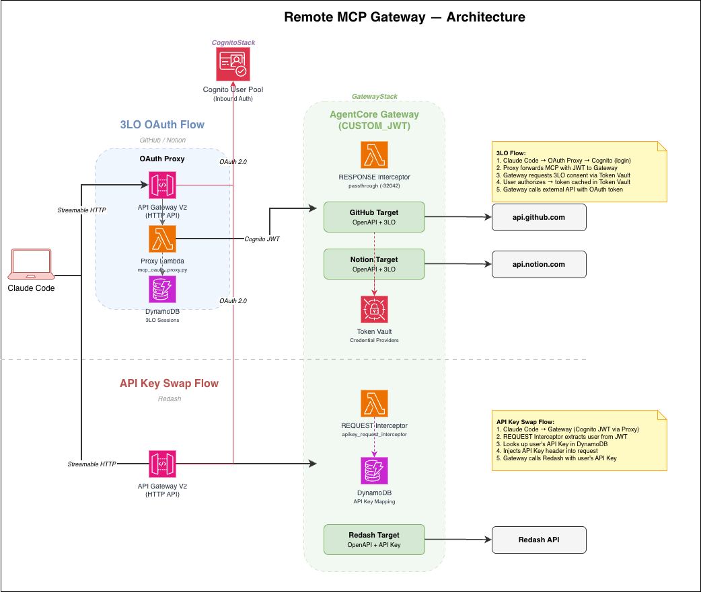

# Remote MCP Gateway CDK

Amazon Bedrock AgentCore Gateway for Claude Code MCP integration.
Single gateway with multiple targets (GitHub, Notion, Redash) — one Cognito login covers all tools.

Based on the official AgentCore samples:
- [IDE Gateway Tool (Serverless OAuth Proxy)](https://github.com/awslabs/agentcore-samples/tree/main/01-tutorials/02-AgentCore-gateway/04-integration/03-ide-gateway-tool) — OAuth proxy pattern for VS Code / Claude Code
- [Fine-Grained Access Control](https://github.com/awslabs/agentcore-samples/tree/main/01-tutorials/02-AgentCore-gateway/09-fine-grained-access-control) — JWT-scope-based interceptor pattern

## Why a Single Gateway

When AI agents call external APIs directly, credentials scatter, access control fragments, and audit becomes hard. A single AgentCore Gateway solves this:

- **Credential isolation** — The agent never holds OAuth tokens or API keys. Tokens stay in Token Vault; API keys stay in DynamoDB + Interceptor Lambda. A compromised agent cannot reach external credentials.
- **Unified audit trail** — Every call to GitHub, Notion, Redash flows through one gateway. Who called what, when, and with which parameters is logged in one place (CloudTrail / CloudWatch Logs).
- **Single login** — One Cognito authentication covers all SaaS targets. No per-service login.
- **Zero agent-side config changes** — Adding a new SaaS target means adding a gateway target, not touching `.mcp.json`.

## Architecture



### Why the OAuth Proxy (API Gateway) is needed

Claude Code's MCP client expects standard OAuth endpoints (`/.well-known/oauth-protected-resource`, `/authorize`, `/token`) at the MCP server URL. AgentCore Gateway validates incoming JWTs but does not act as an OAuth Authorization Server itself.

The OAuth Proxy (Lambda behind API Gateway HTTP API) bridges this gap:

1. **OAuth facade** — Serves RFC 9728 metadata and proxies `/authorize` + `/token` to Cognito, so Claude Code sees a spec-compliant OAuth server at the MCP URL
2. **MCP forwarding** — Forwards MCP requests to AgentCore Gateway with the Cognito JWT attached
3. **3LO callback handling** — Receives the OAuth callback after user consent (GitHub / Notion), calls `CompleteResourceTokenAuth` to bind the token to the user's identity

```
Claude Code ──► API Gateway (HTTP API)
                  └─► OAuth Proxy Lambda
                        ├─ /.well-known/*  → Cognito discovery
                        ├─ /authorize      → Cognito hosted UI
                        ├─ /token          → Cognito token endpoint
                        ├─ /mcp            → AgentCore Gateway (JWT auth)
                        └─ /3lo-callback   → CompleteResourceTokenAuth
```

### Auth Flows

| Flow | Direction | When |
|------|-----------|------|
| **Inbound Auth** (Cognito) | Claude Code → OAuth Proxy → Cognito → JWT | On MCP server connection |
| **Outbound 3LO** (GitHub / Notion) | AgentCore Gateway → SaaS OAuth → User consent → Token Vault | On first tool call to a 3LO target |
| **API Key Swap** (Redash) | AgentCore Gateway → REQUEST Interceptor → DynamoDB lookup → inject header | On every Redash tool call |

### Stacks

| Stack | Description |
|-------|-------------|
| `CognitoStack` | Shared Cognito User Pool + App Client (us-east-1) |
| `GatewayStack` | Unified Gateway + all targets + OAuth Proxy |

## Prerequisites

- AWS CDK v2, Node.js 18+
- An AWS account with Bedrock AgentCore access (us-east-1)
- GitHub OAuth App (optional)
- Notion Integration with OAuth (optional)

## Configuration

All parameters are defined in `cdk/bin/parameter.ts` and validated with Zod at synth time.

```typescript
// cdk/bin/parameter.ts
export const params = ParameterSchema.parse({
  awsAccount: process.env.CDK_DEFAULT_ACCOUNT || process.env.AWS_ACCOUNT_ID || '',
  region: 'us-east-1',
  cognitoDomainPrefix: 'remote-mcp-gateway',
  deployRedash: true,
  redashAdminUserId: 'you@example.com',    // ← edit this
  githubClientId: process.env.GITHUB_OAUTH_CLIENT_ID || undefined,
  githubClientSecret: process.env.GITHUB_OAUTH_CLIENT_SECRET || undefined,
  notionClientId: process.env.NOTION_OAUTH_CLIENT_ID || undefined,
  notionClientSecret: process.env.NOTION_OAUTH_CLIENT_SECRET || undefined,
})
```

If a required field is missing or a client ID is set without its secret, `cdk synth` fails immediately with a Zod validation error.

## Deployment

### 1. Set OAuth secrets (optional, enables 3LO targets)

```bash
export GITHUB_OAUTH_CLIENT_ID="..."
export GITHUB_OAUTH_CLIENT_SECRET="..."
export NOTION_OAUTH_CLIENT_ID="..."
export NOTION_OAUTH_CLIENT_SECRET="..."
```

### 2. Deploy

```bash
cd cdk
npm install
npx cdk deploy --all --require-approval never
```

### 3. Retrieve Redash credentials (if `deployRedash: true`)

Redash admin password and API key are generated at EC2 boot time and stored in Secrets Manager.

```bash
SECRET_NAME=$(aws cloudformation describe-stacks --stack-name GatewayStack \
  --query 'Stacks[0].Outputs[?OutputKey==`RedashCredentialsSecret`].OutputValue' --output text)

aws secretsmanager get-secret-value --secret-id $SECRET_NAME \
  --query SecretString --output text | jq .
```

Returns:
```json
{
  "admin_email": "admin@redash.local",
  "admin_password": "...",
  "pg_password": "...",
  "api_key": "..."
}
```

> The EC2 instance takes a few minutes to complete setup. If the secret is empty, wait and retry.

### 4. Create a Cognito user

```bash
USER_POOL_ID=$(aws cloudformation describe-stacks --stack-name CognitoStack \
  --query 'Stacks[0].Outputs[?OutputKey==`UserPoolId`].OutputValue' --output text)

aws cognito-idp admin-create-user \
  --user-pool-id $USER_POOL_ID \
  --username your-email@example.com \
  --user-attributes Name=email,Value=your-email@example.com Name=email_verified,Value=true \
  --temporary-password 'TempPassword123!' \
  --message-action SUPPRESS

aws cognito-idp admin-set-user-password \
  --user-pool-id $USER_POOL_ID \
  --username your-email@example.com \
  --password 'YourSecurePassword123!' \
  --permanent
```

### 5. Set OAuth App callback URLs

After deploy, get the credential provider callback URLs:

```bash
# GitHub
aws bedrock-agentcore-control get-oauth2-credential-provider \
  --name $(aws cloudformation describe-stacks --stack-name GatewayStack \
    --query 'Stacks[0].Outputs[?OutputKey==`GitHubCredentialProviderName`].OutputValue' --output text) \
  --query callbackUrl --output text

# Notion
aws bedrock-agentcore-control get-oauth2-credential-provider \
  --name $(aws cloudformation describe-stacks --stack-name GatewayStack \
    --query 'Stacks[0].Outputs[?OutputKey==`NotionCredentialProviderName`].OutputValue' --output text) \
  --query callbackUrl --output text
```

Set these URLs in your OAuth App settings:
- **GitHub**: Settings > Developer settings > OAuth Apps > Authorization callback URL
- **Notion**: My Integrations > OAuth > Redirect URI

> These URLs change when the credential provider is recreated (stack delete + create).

### 6. Configure `.mcp.json`

```bash
# Get the values
MCP_URL=$(aws cloudformation describe-stacks --stack-name GatewayStack \
  --query 'Stacks[0].Outputs[?OutputKey==`McpUrl`].OutputValue' --output text)
CLIENT_ID=$(aws cloudformation describe-stacks --stack-name CognitoStack \
  --query 'Stacks[0].Outputs[?OutputKey==`AppClientId`].OutputValue' --output text)

echo "MCP URL: $MCP_URL"
echo "Client ID: $CLIENT_ID"
```

Add to your `.mcp.json`:

```json
{
  "mcpServers": {
    "remote-mcp": {
      "type": "http",
      "url": "<MCP_URL>",
      "oauth": {
        "clientId": "<CLIENT_ID>",
        "callbackPort": 9090
      }
    }
  }
}
```

One entry covers all tools (GitHub, Notion, Redash).

### 7. Update gateway target `defaultReturnUrl` (3LO only)

The 3LO targets are created with a placeholder `defaultReturnUrl`.
After deploy, update them to point to the proxy's `/3lo-callback` endpoint:

```bash
GATEWAY_ID=$(aws cloudformation describe-stacks --stack-name GatewayStack \
  --query 'Stacks[0].Outputs[?OutputKey==`GatewayId`].OutputValue' --output text)
PROXY_URL=$(aws cloudformation describe-stacks --stack-name GatewayStack \
  --query 'Stacks[0].Outputs[?OutputKey==`ProxyUrl`].OutputValue' --output text)

# List targets
aws bedrock-agentcore-control list-gateway-targets \
  --gateway-identifier $GATEWAY_ID \
  --query 'targets[].{name:name,targetId:targetId}' --output table

# For each 3LO target (github/notion), update defaultReturnUrl:
aws bedrock-agentcore-control update-gateway-target \
  --gateway-identifier $GATEWAY_ID \
  --target-id <TARGET_ID> \
  --name <TARGET_NAME> \
  --target-configuration '{"mcp":{"openApiSchema":{"inlinePayload":"..."}}}' \
  --credential-provider-configurations '[{
    "credentialProviderType": "OAUTH",
    "credentialProvider": {
      "oauthCredentialProvider": {
        "providerArn": "<PROVIDER_ARN>",
        "grantType": "AUTHORIZATION_CODE",
        "defaultReturnUrl": "'$PROXY_URL'/3lo-callback",
        "scopes": [...]
      }
    }
  }]'
```

## Key Files

| File | Description |
|------|-------------|
| `cdk/bin/mcp-3lo-runtime-stack.ts` | CDK app entry point |
| `cdk/bin/parameter.ts` | Deployment parameters (Zod-validated) |
| `cdk/lib/cognito-stack.ts` | Shared Cognito User Pool |
| `cdk/lib/gateway-stack.ts` | Unified Gateway + all targets + OAuth Proxy |
| `cdk/lib/constructs-3lo/` | 3LO credential provider constructs (GitHub, Notion) |
| `cdk/lib/constructs-apikey/` | API Key Swap constructs (DynamoDB, interceptor, Redash) |
| `cdk/lib/constructs/` | Shared constructs (Cognito callback registration) |
| `cdk/lambda/mcp_oauth_proxy.py` | OAuth proxy Lambda |
| `cdk/lambda/notion_elicitation_interceptor.py` | Response interceptor (passthrough) |
| `cdk/lambda/apikey_request_interceptor/` | API Key injection interceptor |
| `cdk/openapi/github-api.yaml` | GitHub API OpenAPI spec |
| `cdk/openapi/notion-api.yaml` | Notion API OpenAPI spec |
| `cdk/openapi/redash-api.yaml` | Redash API OpenAPI spec |
| `cdk/test/nag.test.ts` | cdk-nag security compliance tests |

## Testing

```bash
cd cdk
npm test
```

Runs [cdk-nag](https://github.com/cdklabs/cdk-nag) AwsSolutions checks against both stacks. Any new security finding will fail the test unless explicitly suppressed with a documented reason in `test/nag.test.ts`.

## Troubleshooting

### "Invalid or expired session" on 3LO callback
- Check DynamoDB session table (TTL: 10 min)
- Verify `defaultReturnUrl` points to `<PROXY_URL>/3lo-callback`
- Ensure the proxy Lambda has `secretsmanager:GetSecretValue` permission

### "invalid_scope" from Cognito
- AgentCore Gateway requests all OIDC scopes from Cognito discovery (including `phone`)
- The CDK Cognito stack includes all scopes; if using external Cognito, add `phone` scope

### "redirect_mismatch" from Cognito
- The proxy's `/callback` URL must be in Cognito's allowed callback URLs
- The CDK stack auto-registers this via a Custom Resource

### Credential provider callback URL changed
- Happens when the credential provider is recreated (stack delete + create)
- Update the OAuth App callback URL from the stack output `GitHubOAuthCallbackUrl` / `NotionOAuthCallbackUrl`

### Auth link not displayed in Claude Code
- The response interceptor must pass through `-32042` responses unchanged
- MCP protocol version must be `2025-11-25`

## License

MIT License
